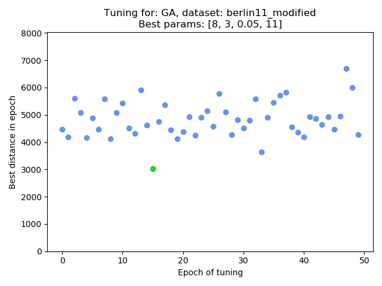

## Heuristic auto-tuner 

This is a simple auto-tuner for heuristics implemented here:
* [Genetic Algorithm](https://github.com/anty-filidor/MRP_genetic_algorithm)
* [Tabu Search](https://github.com/anty-filidor/MRP_tabu_search)
* [SImulated Annealing](https://github.com/anty-filidor/MRP_simulated_annealing)

Those algorithms work on datasets avaliable [here](https://wwwproxy.iwr.uni-heidelberg.de/groups/comopt/software/TSPLIB95/STSP.html).

Note, that this tuner is just a random search method, but it works quite good. Usage of programm:

`tuner = AutoTuner('name_of_dataset', 'path_to_datasets_folder')`

`best_param = tuner(GA.GeneticAlgorithm, 50, {'population_size': [5, 10], 'size_of_elite': [0, 5],
                                            'mutation_ratio': [0.01, 0.5], 'epochs': [1, 20]}, 'GA')`

`tuner.plot_simply_stats()`

Example plot after tuning:

